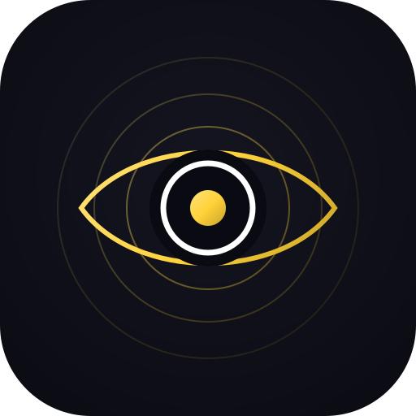

<div align="center">



**Real-time observability for Claude Code agents.**

*Every session, tool call, and agent spawn — streaming live to your browser. Zero token cost.*

---

[](https://github.com/wp-media/claude-marketplace)
[](LICENSE)
[](https://github.com/wp-media)

</div>

---

## What Is Podium?

Podium is a **Claude Code plugin** that captures every hook event the harness fires — session starts, tool calls, agent spawns — and streams them to a real-time browser dashboard.

No extra LLM calls. No orchestrator changes. No polling your terminal. Just open the dashboard and watch.

---

## Install

```
/plugin marketplace add wp-media/claude-marketplace
/plugin install podium@wp-media
```

Then in any Claude Code session:

```
/podium setup    ← register hooks once (restart Claude Code after)
/podium start    ← open http://localhost:4820
```

---

## What You See

| View | What it shows |
|---|---|
| **Dashboard** | Live session feed — every active run across all your projects |
| **Sessions** | Full history with status, duration, agent count |
| **Activity Feed** | Every tool call streaming in real time |
| **Analytics** | Token usage by model, tool frequency, concurrency, cost |
| **Kanban Board** | Sessions by status — running, success, failed |
| **Workflows** | Multi-agent pipelines with hierarchy and timing |

---

## How It Works

```
Claude Code harness
      │
      │  fires on every hook event
      │  (SessionStart, PreToolUse, PostToolUse, SubagentStart …)
      ▼
~/.claude/podium/hook.mjs     ← reads stdin JSON, writes JSONL backup, exits < 1.5 s
      │
      │  fire-and-forget POST (waits for response before exit)
      ▼
server.mjs  →  dashboard/server/index.js   Express + SQLite + WebSocket  :4820
      │
      │  WebSocket push on every event
      ▼
dashboard/client/dist/        ← pre-built React SPA
```

- **JSONL** (`{cwd}/.podium/{session_id}/events.jsonl`) is a local backup — not the primary stream.
- **Live data** reaches the browser via the HTTP POST → WebSocket push chain above.
- **Port discovery**: on startup the server writes `~/.claude/.agent-dashboard.json` with its live port and PID. The hook reads this file so it posts to the right port even when `DASHBOARD_PORT` is customised.

Token cost: **zero**. Hooks run outside the LLM turn.

---

## Commands

| Command | What it does |
|---|---|
| `/podium` | Show the subcommand reference (alias for `/podium help`) |
| `/podium setup` | Register Claude Code hooks (once per project or globally) |
| `/podium start` | Start the dashboard server → http://localhost:4820 |
| `/podium stop` | Stop the server |
| `/podium restart` | Stop then start |
| `/podium status` | Health check + hook status + stats |
| `/podium logs` | Tail the server log |
| `/podium uninstall` | Remove hooks from settings.json |

---

## Repository Layout

```
podium/
│
├── .claude-plugin/
│   └── plugin.json          ← Claude Code plugin manifest
│
├── commands/
│   ├── podium.md            ← /podium skill
│   └── podium-health.md     ← /podium-health skill
│
├── dashboard/
│   ├── client/              ← React + TypeScript + Vite frontend
│   │   ├── src/             ← components, pages, hooks
│   │   └── dist/            ← pre-built SPA (committed — no build needed on install)
│   └── server/              ← Express API (dev mode only)
│
├── hook.mjs                 ← Claude Code hook — reads events, writes JSONL
├── server.mjs               ← Zero-dep HTTP + SSE server (production)
├── install.mjs              ← Registers / removes hooks in settings.json
└── release.sh               ← Bump version, build, tag, push
```

---

## Releasing a New Version

```bash
./release.sh 1.2.0
```

The script will:
1. Bump the version in `.claude-plugin/plugin.json`, `dashboard/client/package.json`, `dashboard/package.json`, and `package.json`
2. Install server dependencies, then build the dashboard client (bakes the version into the bundle)
3. Commit the version bump + built `dist/`
4. Tag `v1.2.0` and push branch + tag

Then create the GitHub Release from the tag — plugin users pick it up automatically on their next Claude session.

---

## Local Development

```bash
# Install all dependencies (server + client)
cd dashboard && npm install && cd client && npm install

# Or use the setup script:
cd dashboard && npm run setup

# Run dev server (hot reload, proxies API to Express backend)
npm run dev

# Build for release
cd client && npm run build
```

The dev server proxies `/api/*` to `server.mjs` on port 4820. Set `DASHBOARD_PORT` if you need a different port:

```bash
DASHBOARD_PORT=4821 npm run dev
```

---

## CLI Reference

```bash
node server.mjs  [--port 4820] [--temp-root .podium]
node install.mjs [--check] [--uninstall] [--global]
```

**`install.mjs` flags**

| Flag | Effect |
|---|---|
| *(none)* | Install stable hooks in project `.claude/settings.json` |
| `--global` | Install in `~/.claude/settings.json` (all projects) |
| `--check` | Exit 0 if hooks are active, 1 if not |
| `--uninstall` | Remove Podium hooks from settings.json |

---

<div align="center">

*Stand here. See everything. Pair with [Maestro](https://github.com/wp-media/maestro) — Built at WP-Media*

</div>
